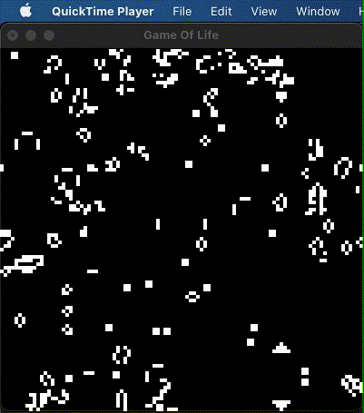

# Game of Life in Haskell

## Options

- `--seed INT`: seed to initialize the grid
- `--gridSize INT`: squared size of the grid
- `--speed INT`: number of transitions per second

Example:

`gengol --seed 42 --gridSize 100 --speed 10`

## Building

`cabal build -O2`
